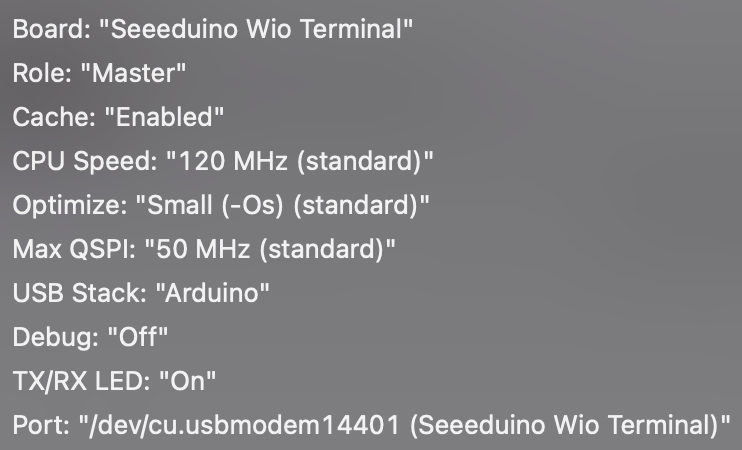
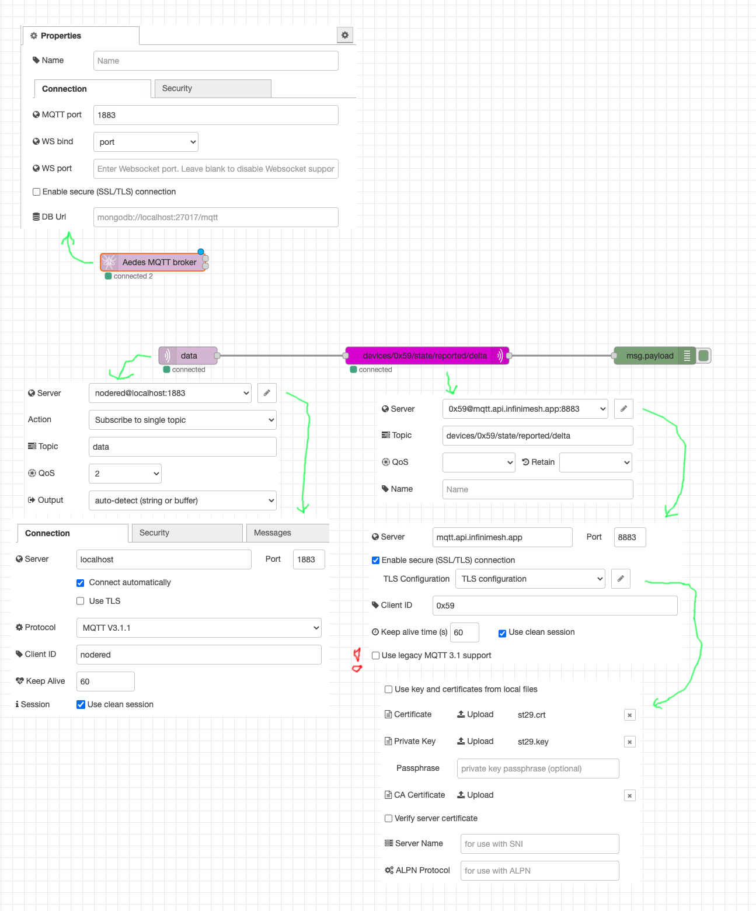

# Sensor-Terminal QuickStart
Welcome to the Infinite Devices Sensor-Terminal!

First, you need to update the firmware on the SoC:

	git clone https://github.com/Seeed-Studio/ambd_flash_tool
    cd ambd_flash_tool
	python3 ambd_flash_tool.py erase
	python3 ambd_flash_tool.py flash	

Next, install and run [Arduino](https://www.arduino.cc/en/software). In Preferences, add

    https://files.seeedstudio.com/arduino/package_seeeduino_boards_index.json
	
and install "Seeed SAMD Boards". Copy the content of [library-package](library-package) in the libraries folder of your Arduino folder (in Documents or "My Documents").

Open [sensorterminal-quickstart.ino](sensorterminal-quickstart.ino) from this repo. Set all parameters in Tools according to this screenshot (serial port might be different, or course) and hit play.

Your Sensor-Terminal should show the time after getting it from the Internet. For more verbose debug output, activate the Serial Monitor.

## Infinimesh

Together with your Sensor-Terminal, you have received a login for the Infinimesh platform. To create your device in Infinimesh, you first need to create a device certificate. Run

    bash create-certs.sh device

to generate device.crt and device.key. Login to [Infinimesh](https://console.infinimesh.app/), click on the + button, give the device a name (e.g. "Terminal_40"), select your namespace, set the device to enabled and upload the device.crt file. (The device.key file is the private key, don't give it away!) Click submit and the device is created and given an id (hex number like 0x59). 

As you cannot directly connect to Infinimesh from the sensor terminal yet (group 3 will be working on that), you will need to install [Node-RED](https://nodered.org/#get-started) to receive the MQTT messages from the Sensor-Terminal and send them on to Infinimesh. Here's a working setup, change the device ID to yours:

Happy hacking!